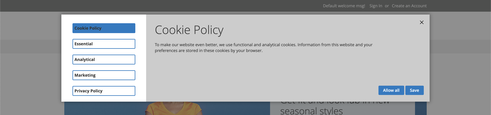

> We deprecated this module as we can not guarantee GDPR compliance. We advise to look into other solutions like Cookiebot.

# Cookie Consent for Magento 2

With this module your store can become GDPR compliant in no time.
As a store-owner, you can now divide cookies into categories and have a quick overview of what cookies are being used by your store.
Your customers can select their cookie preferences from within a customizable popup.

## Key features
* Customizable consent pop-up
* Cookie consent overview widget
* Customers can manage their preferences with the preference popup
* Customizable cookie/privacy policy

## Get started
Install the module using composer

`composer require phpro/mage2-module-cookie-consent`

Execute patches

`bin/magento setup:upgrade`

## Read more
[Documentation](docs)
