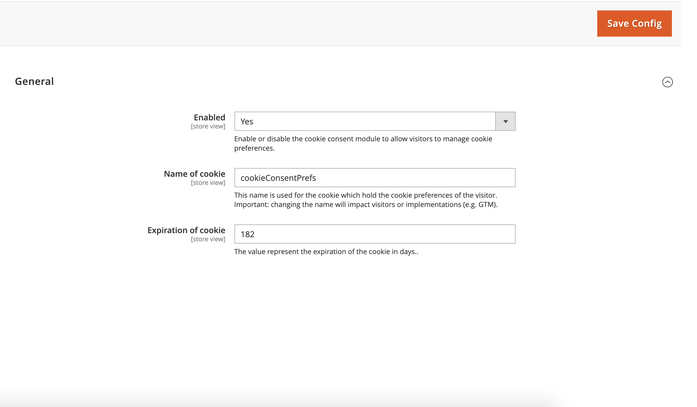
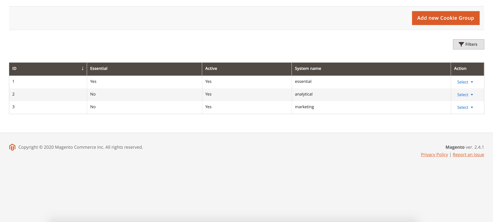
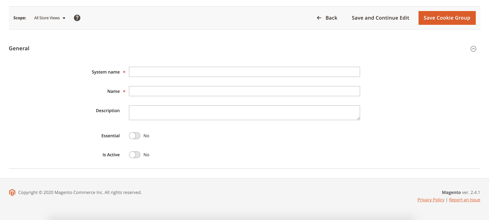

# Configuration

## General Configuration

The module configuration can be found at **Stores > Settings > Configuration > General > Cookie Consent**:

**Enabled** - Set to yes to enable the module

**Name of cookie** - Enter the preferred cookie name which contains the preferences. (**Default=cookieConsentPrefs**)

**Expiration of cookie** - Enter the amount of days to pass for the cookie to expire (**Default=182**)

## Cookie Group Management

The cookie group grid can be found at **Customers > Cookie Consent > Cookie Groups**

On the grid the ID and System name are displayed. Also you can see if each group Is Essential and Is Enabled.

To configure any group, click the dropdown in the Action column and select Edit.

To delete any group, click the dropdown in the Action column and select Delete.

To create a new group, click Add new Cookie Group.

The **essential**, **analytical**, **marketing** & **personalization** cookie groups are created automatically on installation of the module. 
These groups can be altered to your needs.

### Create

5 fields are available on the create form for the cookie group:

**System name** - This field is used for background processes of te module. This is a required field

**Name** - This is the actual name of the cookie which will be displayed to the users. This is a required field.

**Description** - The description of the cookie group.

**Essential** - Toggle this if the cookie group is essential for your website. When toggled this cookie group
will automatically be enabled for the user.

**Is Active** - Toggle this is the cookie group has to be active. When this is not toggled the cookie group will not be
visible to the customers.

### Edit

The edit form is the same as the create form. You are able to switch between store views to save data for the different
store views for that specific cookie group. **Only the Name & Description field can be stored for a specific store view**

### GTM

More information for GTM configuration can be found [here](./GTM.md)

### Google Consent

More information for Google consent configuration can be found [here](Consent.md)

