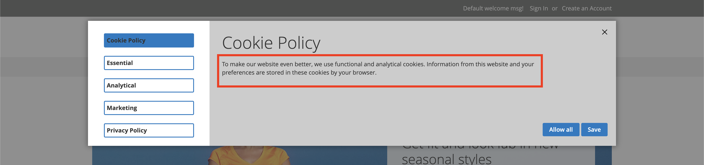
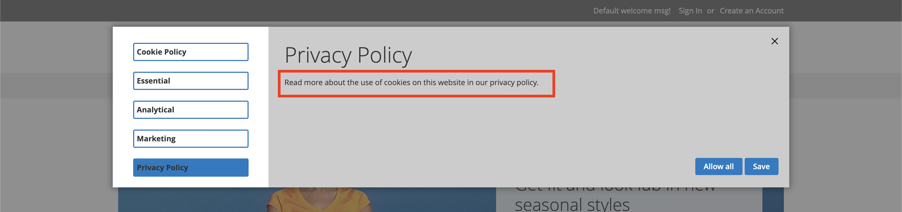
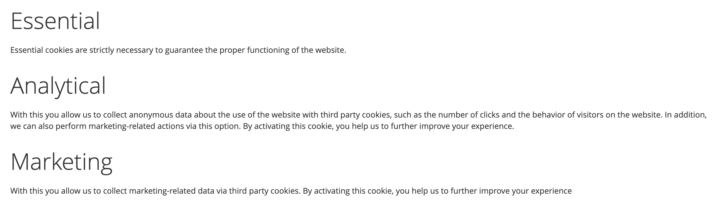
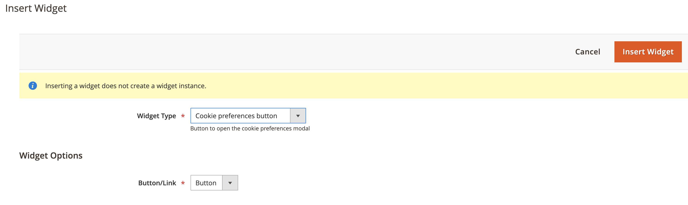
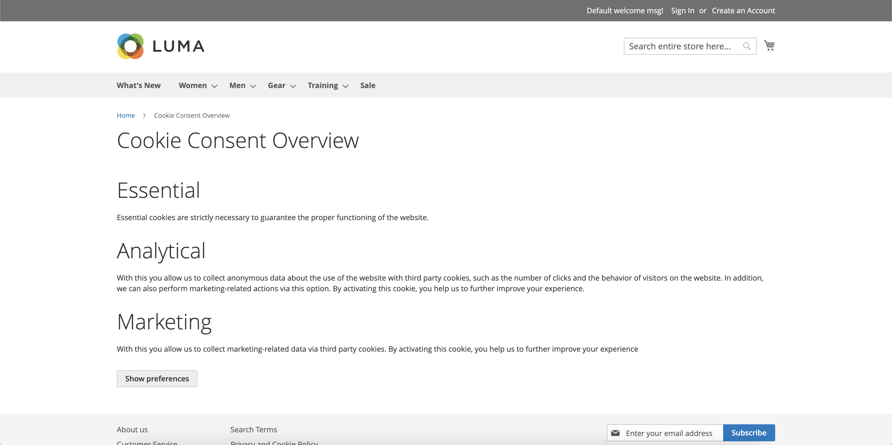

# Content

## Cms Blocks

The following CMS blocks are automatically created on the installation of the module:

* **phpro_cookie_consent_cookie_policy_content**
* **phpro_cookie_consent_privacy_policy_content**

These CMS blocks can be found at **Content > Elements > Blocks** and are used in the preferences popup.

### Cookie Policy

Identifier: **phpro_cookie_consent_cookie_policy_content**

This CMS block displays the description for the cookie policy tab in the preferences popup. This content can be altered 
to your needs.

### Privacy Policy

Identifier: **phpro_cookie_consent_privacy_policy_content**

This CMS block displays the description for the privacy policy tab in the preferences popup. This content can be altered 
to your needs.

## Widgets

### Cookie consent overview

The cookie consent overview widget can be used to display an overview of the active cookie groups and their description.

This widget contains no arguments.

### Cookie preferences button

The cookie preferences button widget can be used to display a button/link which opens the preferences popup. This way the
users are able to change their preferences.

This widget contains 1 argument:

* **Button/Link** - depending on your choice the widget will be shown as a generic link or button.

**Config**

**Result**

## Cms Page

A CMS page containing the [Cookie consent overview widget](#cookie-consent-overview) &
 [Cookie preferences button widget](#cookie-preferences-button) is created on the module installation.
 
url key: **consent-overview**

