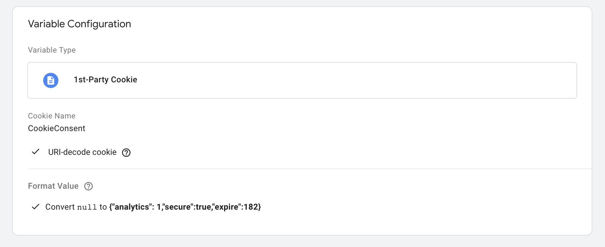
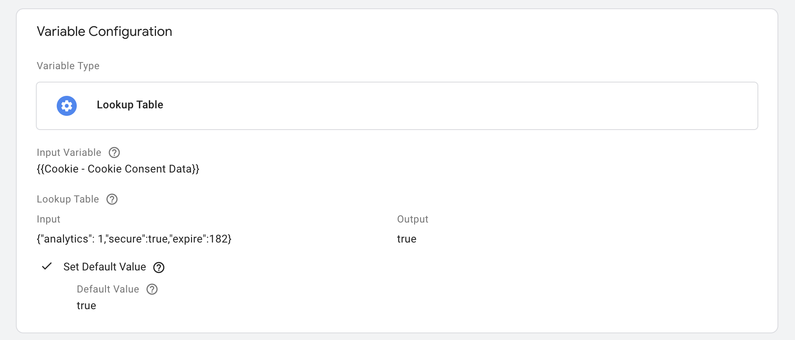
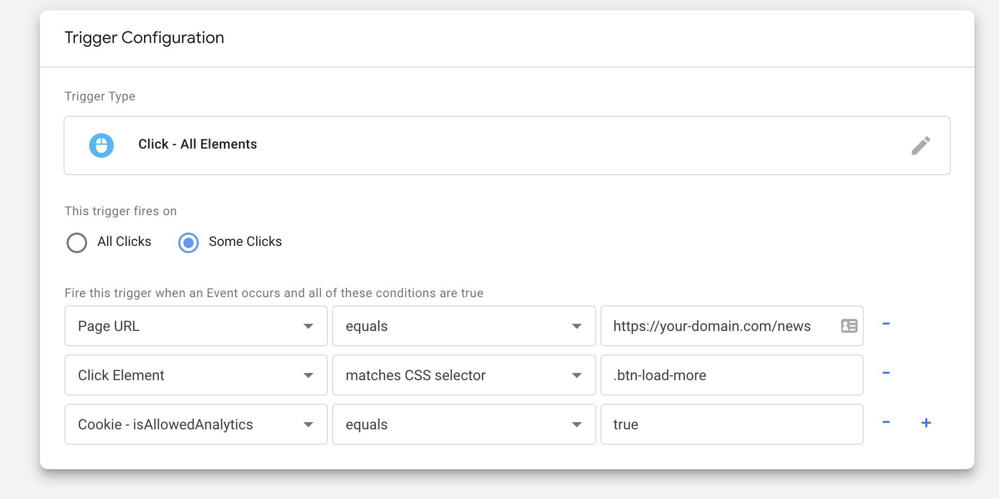

# GTM

Cookie consent can be arranged via Google Tag Manager by reading the cookie data in GTM and making decisions based on the choice of the user.

## Example

Google Analytics setup example for Analytics Cookie Group.

### Variables

Following variables are set to determine other variables and to activate triggers or exclude tags.

#### Cookie Consent Data

Create a new 1st-Party Cookie variable.

**Url-decode cookie** - this has to be selected, the cookie needs to be url-decoded

**Format value** - define the value format of the cookie.

#### isAllowedAnalytics

Create a new Lookup Table variable

**Input variable** - The earlier created 1st-Party Cookie variable is used here

**Input** - All possible values of the cookie are used here with their outputs

**Default value** - Set a default value which is used whenever none of the inputs occur

### Triggers

The new variables offer the possibility to fine-tune triggers in Google Tag Manager. They can be used as conditions for activating certain tags. Below is an example of a trigger that is activated when a button is clicked, but only if the user indicates that he / she accepts analytical cookies.

